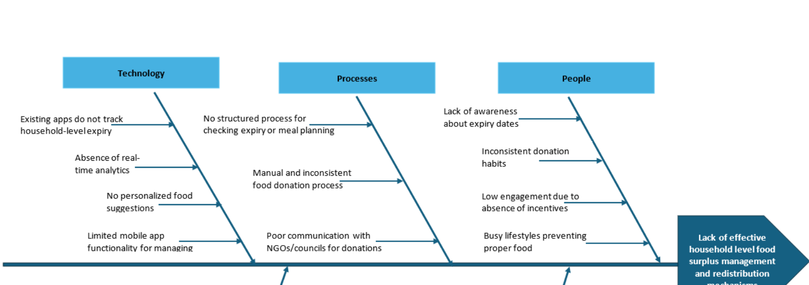
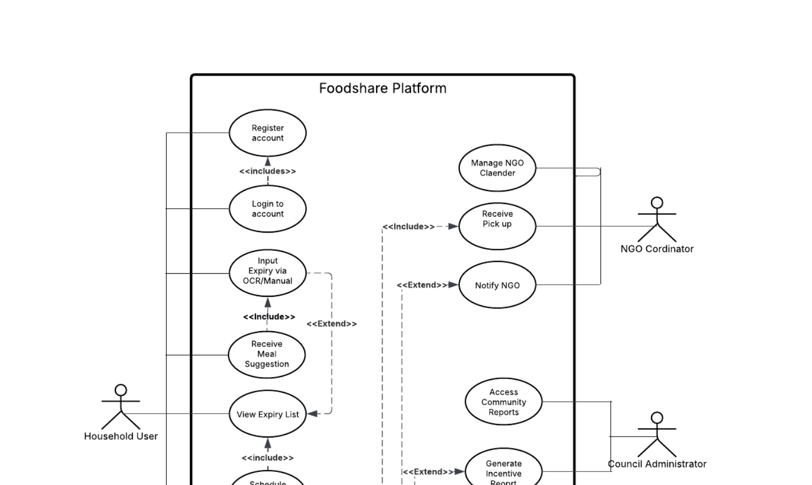
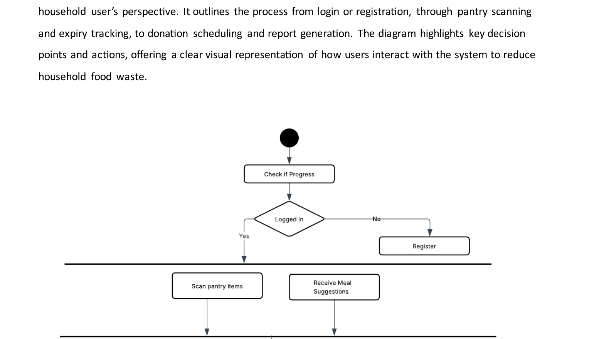
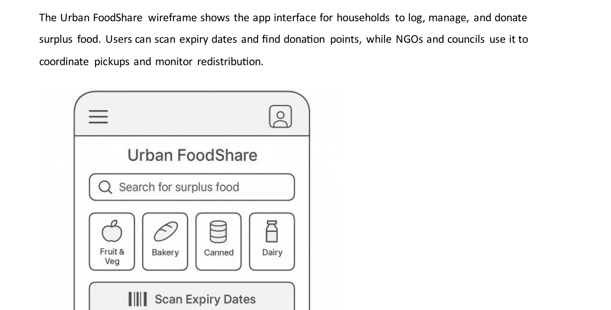

# Urban FoodShare: Requirements Analysis & System Modelling

Requirements engineering project for a concept mobile platform tackling household food waste through expiry tracking, meal planning, surplus-food donation scheduling and NGO/council coordination. Produced 11 documented requirements, supported by stakeholder analysis, user stories, use cases, activity modelling and wireframing.

## The problem

Household food waste traces back to six root-cause categories: Technology, Processes, People, Management, Environment, and structural gaps in how households, NGOs and councils coordinate.

  

No standardised mechanism exists for tracking household-level food usage; existing apps don't track expiry at the household level; and donation processes between households, NGOs and councils remain manual and uncoordinated.

## What the platform does

Three actor groups use the platform: the **Household User** (input expiry, view suggestions, schedule donations, track usage), the **NGO Coordinator** (manage pickup calendar, receive and act on donation notifications), and the **Council Administrator** (access community-level reports, generate incentive reports).

  

The core household flow, from login to donation, is modelled as an activity diagram:

  

And the interface itself: a household user searches or browses by food category, scans expiry dates via the phone camera, and sees nearby donation opportunities on the home screen.

  

## Key requirements

Of the 11 documented requirements, five define the functional core:

1. **Input expiry dates via OCR or manual entry**: OCR automates barcode scanning; manual entry backs up diverse packaging types and tech literacy levels.
2. **Suggest meal plans based on food nearing expiry**: proactively reduces waste by encouraging consumption before items expire.
3. **Allow scheduling of pickups with local NGOs**: reduces friction in redistribution logistics so surplus reaches NGOs before it spoils.
4. **Maintain user profiles with donation history**: builds accountability and trust with NGO partners, and motivates users through a visible impact record.
5. **Display nearby donation points**: gives real-time pickup alternatives so no donation opportunity is missed to unavailability.

The remaining six cover quality requirements (performance, usability), business rules, and risk/validation constraints, all traced back to the fishbone root causes above.

## Methodology

1. **Root-cause analysis**: fishbone diagram to structure the problem space across five causal categories
2. **Stakeholder and persona analysis**: identified household users, NGOs, councils and backend services as primary/secondary actors
3. **Requirements elicitation**: 11 functional, quality and business requirements, each with an explicit rationale
4. **Use case and activity modelling**: UML use case diagram plus an activity diagram for the household donation flow
5. **Wireframing**: low-fidelity mobile interface to validate the requirements against a concrete user experience
6. **Input/output and risk validation**: checked requirements against data-entry constraints and identified risk mitigation strategies

## Tools & techniques

`Requirements Engineering` `Stakeholder Analysis` `User Stories` `Acceptance Criteria` `Use Case Modelling` `Activity Diagrams` `Wireframing` `Risk Analysis`

## Repository contents

- [`Urban-FoodShare-Full-Report.pdf`](Urban-FoodShare-Full-Report.pdf): full report, including stakeholder analysis, all 11 requirements with rationale, user stories, acceptance criteria, and input/output validation
- `images/`: diagrams referenced above
